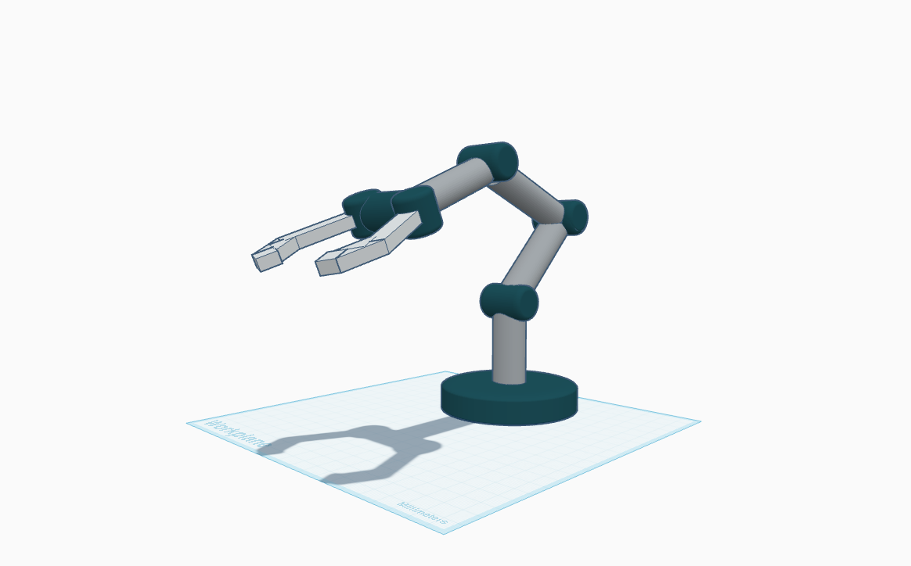
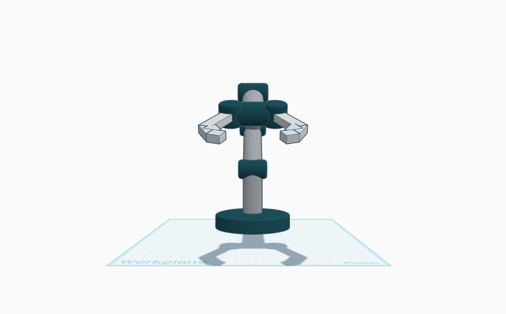
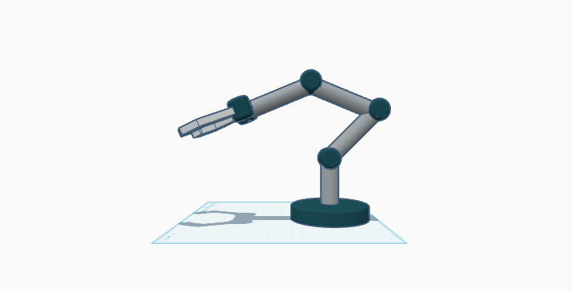

# Robotic Arm — 5 DOF (3D Design)

## Overview
A clean 3D CAD design of a **five degrees of freedom (5 DOF) robotic arm**.  
This submission includes the CAD model files, renders from multiple views, and a breakdown of each joint's degree of freedom.

## Degrees of Freedom Breakdown
- **J1 – Base (Yaw):** Rotation around the Z-axis to turn the entire arm.
- **J2 – Shoulder (Pitch):** Raises/lowers the first arm segment.
- **J3 – Elbow (Pitch):** Extends or folds the second arm segment.
- **J4 – Wrist (Pitch):** Controls the tilt of the tool/gripper.
- **J5 – Wrist (Roll):** Rotates the tool/gripper around its axis.

> **Note:** The model visually supports all 5 DOF; J5 is implemented if the gripper can rotate.

## Files
- `Robotic Arm 5 DOF.stl` – STL mesh of the assembled arm.
- `tinker.obj` + `obj.mtl` – OBJ version with material mapping file.
- `images/` – Rendered views of the robotic arm.

### Folder Structure
```
Robotic Arm 5 DOF - 3D Design/
├── Robotic Arm 5 DOF.stl
├── Robotic Arm 5 DOF.svg
├── tinker.obj
├── obj.mtl
├── front_view.png
├── side_view.png
└── another_view.png
```

## Images & Joint Mapping

### Full Design


### Joint Mapping
1. **Base (J1)** — Rotates horizontally.  
2. **Shoulder (J2)** — Tilts first link up/down.  
3. **Elbow (J3)** — Tilts second link up/down.  
4. **Wrist Pitch (J4)** — Tilts gripper.  
5. **Wrist Roll (J5)** — Rotates gripper.

  
  


